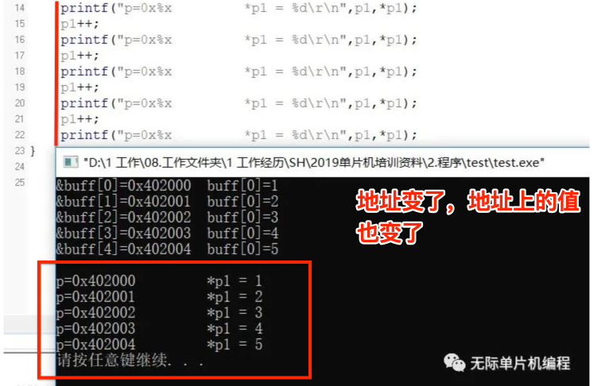
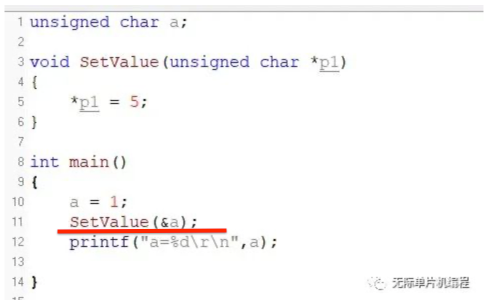
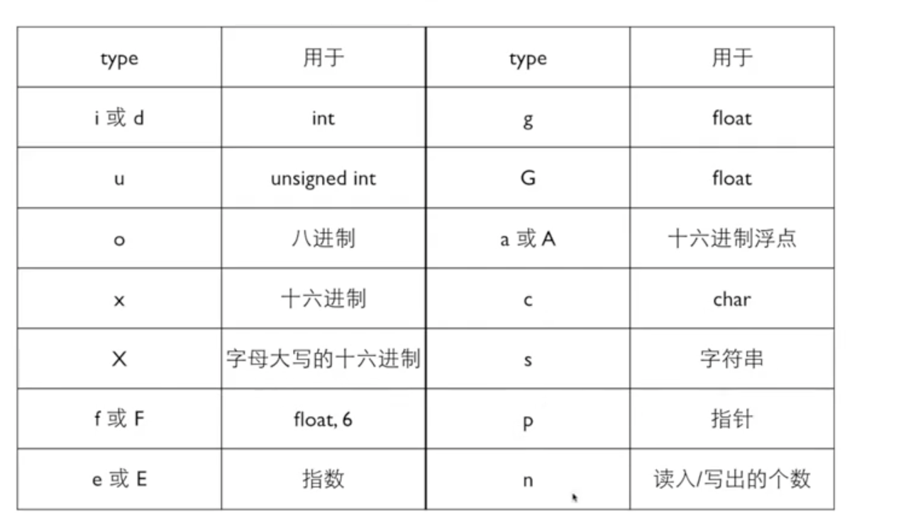

# 「02」初学C语言笔记

##1.不同类型运算符的优先级

> 本题中的表达式，有以下4种运算符，它们是具有不同优先级的运算符，因此这里只需考虑优先级，无需考虑结合性
>
> - 复合赋值运算符 += 
> - 关系运算符 > 
> - 条件运算符 ? : 
> - 增强运算符 ++ 
>
> 优先级从高到低：增强运算符++、关系运算符>、条件运算符?、**赋值运算符+=**

1. 赋值优先级最差

2. 大小于比？厉害

##2.指针和数组；地址和变量

> 1. 数组**本身（指的是a）**表达的是地址：int *p = a;
>
> 2. **数组单元a[0]**表达的是变量，要用&取地址。a==&a[0];

## 指针和数组的通用的东西

1. **[ ]** 运算符可以对数组，也可以对指针。p[0]==a[0]

2. * 运算法可以对指针，也可以对数组。*a=25

##3.区别字符%c和字符串%s

> 1. 字符%c只能输入输出一个字符
>
> 例：char a[]="123"
>
> printf("%c",a[0]);    **//输出"1"**
>
> 2. 字符串%s可以输入一串不超过20字符的字符串。
>
>  printf("%s",a);    // **输出"123"**  

##4.字符串定义

###1.字符串变量定义

> /* 定义一个字符串变量格式：
>
> **char b[字符的长度]="初始化赋值"**   

​    **注意字符长度和赋值，必须选一个或者全写，不能都不选。**

​    例如：char b[123]="123";

###2.字符串常量定义

> 由于常量字符串存储在常量空间中，
>
> 所以只需要定义一个指针，指向该地址即可。
>
> **如char \*s = "test string"**

### 3.字符指针定义

> **char \*p**

## 5.指针变量赋值

> ***指针变量 = 数值**
>
> **如：\*p = 10;**
>
> 这样的操作可以改变指针变量指向那个内存地址的数据。

> 通过:
>
> **a = \*p;**
>
> 来获取指针变量指向那个内存地址的数据。

**虽然指针变量是指向别的内存地址的，但是变量本身还是需要一个地址空间来存储的**。

**指针容易把人搞晕的就是，*****指针变量本身的存储地址*****和*****指向的地址*****分不清楚**，这个是**两个概念**，要记住了。

printf("%x",&p)

printf("%x",p)

指针本身的存储地址是&p获得

指向的地址是直接用p获得

### 1.指针和数组

**定义了2个指针变量p1和p1，分别指向buff, &buff[0]。**

**buff默认的是数组下标为0元素的存储地址。**

**所以这里buff和&buff[0]是同一个内存地址，只是写法不一样。**

```
unsigned char buff[5]={1,2,3,4,5};
    unsigned char *p1;
    unsigned char *p2;
    p1 = buff;
    p2 = &buff[0];
    printf("%x\n",buff);
    printf("%x\n",p1);
    printf("%x\n",p2);
```

### 2.**指针自加自减运算**

指针变量除了可以用来获取内存地址的值以外，还可以用来进行加减运算。

但是这个加减呢跟普通变量加减不一样，普通变量加减的是**数值**，而指针变量加减的是**地址.**

{width="400"}

### 3.指针变量作为函数形参

**主要目的是为了改变指针指向地址的值**



## 6.格式化输入输出



## 7.Const和指针

const默认修饰左边的内容即左边的东西不变，如果左边没有东西则修饰其右边的内容

