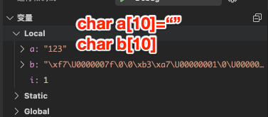

# 不太明白的syntax

## 1.无截止输入符号

如果一些题目没有截止输入的0或-1该怎么处理？

解决：用回车来截止输出。关键语句是`getchar()=='\n'`

```C
    int x[100];
    int i = 0;
    while (1)
    {
        scanf("%d", &x[i]);
        i++;//i表示元素个数
        if (getchar() == '\n')
        {
            break;
        }
    }
```

## 2.全局变量的使用ambiguous

问题在：使用全局变量的时候，出现ambiguous的警示怎么解决

解决：用`extern`来在函数内声明外部变量

```C
// 函数外定义全局变量 x 和 y
int x;
int y;
int addtwonum()
{
    // 函数内要声明变量 x 和 y 为外部变量
    extern int x;
    extern int y;
    }
```

## 3.C语言字符串判断空

- 引入一个问题：

有的时候我们想判断字符串是否为空，我们可以能会想到利用NULL来判断空,但是我们利用这些，发现是不行的！那要怎么办呢？

> 下面呈现的是定义了一个字符数组，但是没有初始化，系统默认的随机值到底是怎么样的。
>
> 同时解释了为什么不可以用NULL来判断

{width="400"}

- 解决：

这个时候我们可以利用函数`strlen（）==0`来判断字符数组是不是为空

> strlen（）是判断到'\0'之前的元素有几个

## 4.字符串怎么一次性输出

- 引入问题：我们知道字符串在C中是字符数组，要想输出数组，我们第一个想到就是取索引通过for来一个个输出，但是有没有一个方法可以直接输出一个字符串呢？

- 解决：

1. 通过格式化%s。
2. 或者是用puts（字符串名）

```
printf("%s\n", str);` `puts(str);
```

## 5.字符串最后'\0'问题

引入问题：如果我们没有给一个字符串初始化，那么这个字符数组里面就是乱码，然后我们通过for一个个下标给他去赋值，它最后的下标不会是字符串结束的表示（‘\0’)

> 下图就是没有初始化的样子

{width="300"}

如何解决？

1. 针对没有初始化的字符串，同时给他for赋值之后，我们要用`a[最后的index]=0或者'\0'`手动给加上字符串的结束标志！

   1. > Oj平台只能用arr【i】=0来判断是不是空
      >
      > 其实自己电脑上arr【i】='\0'是可以的

2. 个人认为最佳的方式是，一开始就给他初始化,表示这个字符数组是空的。

比如`char a[10]={0};`//这个是把每个空间都是放‘0’，感觉有点浪费内存了

比如`char a[10]="";`

> 像这种引用数据类型，最好一开始就初始化

## 6.C语言中3个标准输入区别

gets scanf getchar

1. scanf 用空格和回车作为分隔符

> 一个重要机制：在读取非空白字符之前遇到回车，会忽略回车，并把他从缓冲区过滤掉。

1. gets 只用回车作为分隔符

> 一个重要的机制：遇到'\n'会把它从缓冲区过滤，也就是既不读到变量中，也不留在缓冲区。

1. getchar读回车，也就是吸收掉回车的作用

> 这个的使用场景，当上面是scanf的读入，下面是gets的读入的时候，可以在他们中间放getchar，防止回车对后面gets造成影响

1. 总结成：一个例子：

当输入'\nHello\n'时

1. scanf会按照机制，过滤去第一个回车，再读取Hello，最后把第二个'\n'留在缓冲区
2. gets遇到第一个'\n'会停止读取，并把第一个回车从缓冲区移走

## 7.C中的NULL指针

在变量声明的时候，如果没有确切的地址可以赋值，***为指针变量赋一个 NULL 值是一个良好的编程习惯。***

## 8.求最大公约数的误区

应该从后往前找，不是从前往后找

```C
int maxDivisor(int a, int b){
    int result=1;
    int max;//max来记录ab中的较小的
    if (a<b)
    {
        max=a;
    }   
    while (1)//核心代码
    {
        if (a%max == 0 && b%max == 0)
        {
            result=max;
            break;
        }
        max--;//从后往前
    }
    return result;
}
```

## 9.二维数组作为参数a[][20]

以二维数组作为参数的时候，必须给二维数组的第二个参数写足够大的值。

例如写成`void sum (a[][20])`

> 这是个编译器内部存在的固定翻译的问题

## 10.对回文数的误解

含义：顺读和逆读都是一样的，而不是什么对半分啥的

俩个办法

1. 数字方法

```C
#include<stdio.h>
int main()//依次从个位开始提取，然后*10+%10，最后新数和旧数比较
{
    int x,newed,t,n;
    while(scanf("%d",&x)!=EOF)
    {
        newed=0;
        n=x;
        do
        {
            newed=newed*10+x%10;
            x/=10;
        }while(x>0);
        if(n==newed)
            printf("Yes\n");
        else
            printf("No\n");
    }
    return 0;
}
```

1. 字符串方法

注意：for循环，范围是字符串长度的一半，就可以了

## 11.最大公约数和最小公倍数解决

最大公约数：从后往前遍历

一个更优解：递归解决最大公约数

```cpp
int gcd(int m,int n)
{ 
    if(n==0) return m;    //简单情况
        return   gcd(n,m%n);    //递归调用
}

//主要思路：

// 当非负整数m，n，满足m>=n时，m和n的最大公约数，等于n和m%n的最大公约数。

// 初始条件:当n为0时，最大公约数为m。

//举个例子6 2->2 0->结果就是2
```


最小公倍数：俩数相乘除以最大公约数

## 12.对通过指针传值的误解～

{width="700"}

如上左图所示：函数想要通过地址改变数值，是改变地址内的值，而不是改变整个地址值！！！

> 即：函数内要想通过指针传值，是改变指针地址对应的值，而不是把值的地址传给这个指针！
>
> 比如：地址0001 -> 值5      
>
>  正确做法：地址0001->值8
>
> 错误做法：用8的地址0008 ，改变了原地址0001->0008

## 13.关于清空输入缓冲区的终解

> 简单看：在输入字符串、字符和浮点数之前，都清空缓冲区
>
> while(getchar()!='\n');

1. 通常情况下，我们在输入字符串、字符和浮点数的时候都需要清空输入缓冲区。这是因为字符串、字符和浮点数输入时都可能会读入一个回车符，而回车符会被保存在输入缓冲区中，如果不清空缓冲区，就可能会在下一次输入时读入一个回车符，导致输入错误。

1. 在输入整型数时，我们不需要清空输入缓冲区。这是因为输入整型数时，不会自动读入回车符。例如，如果我们输入"1 2 3"，程序的输出结果就是"1 2 3"，而不是"123"。

## 14.C中字符串赋值问题

在 C 语言中，字符串是以 null 结尾的一维字符数组。因此，可以使用数组赋值的方式来赋值字符串。

{width="700"}

> 注意，在使用第二种方式赋值时，必须手动添加 null 结尾符（'\0'），否则会导致程序的错误。

{width="700"}

## 15.最简形式分数

两个分数相加->分子分母除以最大公约数

分子分母求最大公约数不用函数的形式。

```
    // 约分
    int divisor = b.fenzi;
    int dividend = b.fenmu;
    // 主函数内如何求最大公约数
    while (dividend != 0)
    {
        int remainder = divisor % dividend;
        divisor = dividend;
        dividend = remainder;
    }
    b.fenzi /= divisor;
    b.fenmu /= divisor;
```