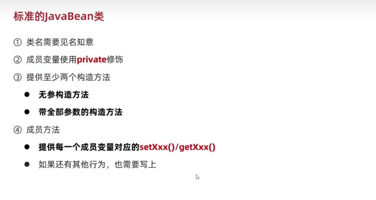
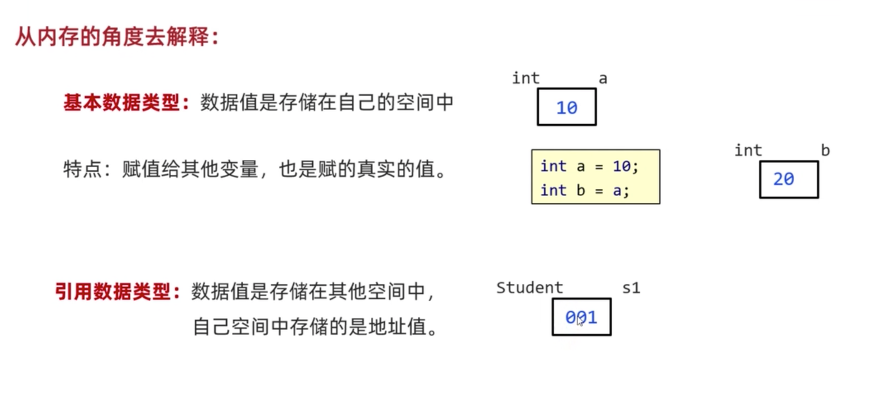
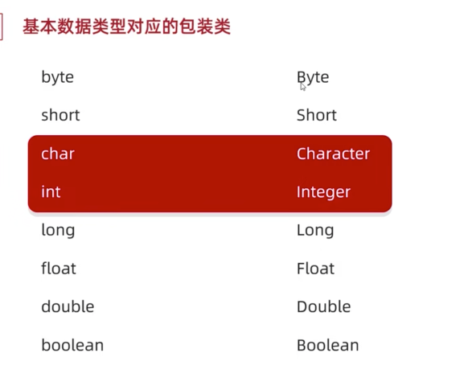
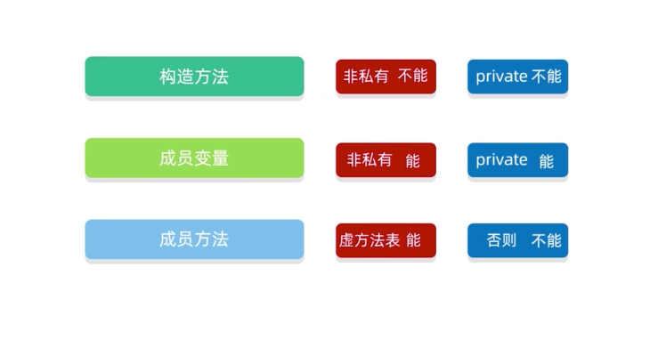
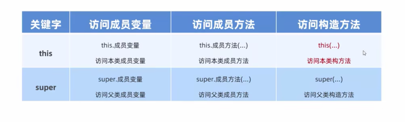
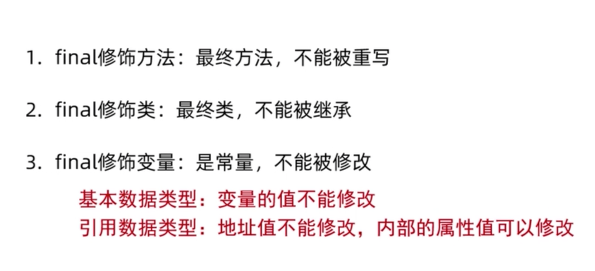
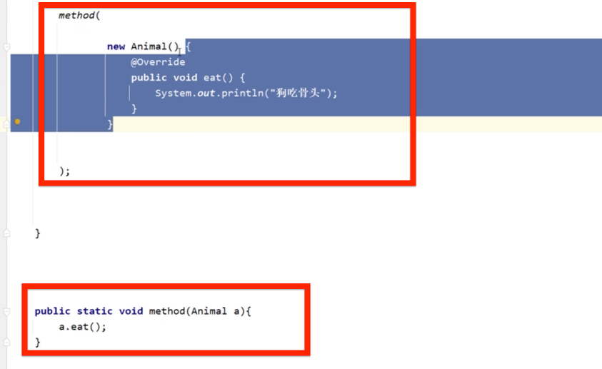
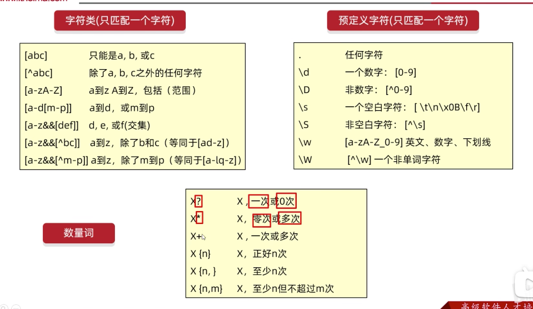
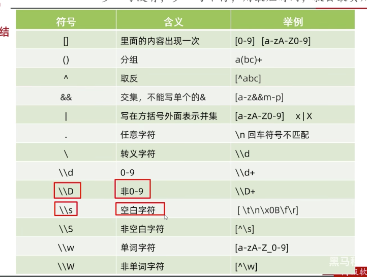
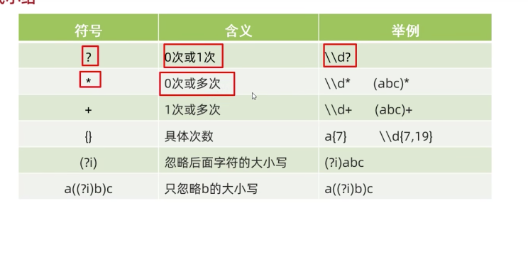

# 「01」面向对象

## 类

### 类的基本格式

定义类-创建对象-使用对象

{width="400"}

### 类的补充知识

1. 类的分类：

javabean类：这个不写main

测试类：写main

2. 类名的格式

首字母大写，且见名知义

3. 一个代码文件可以定义多个类，但是只能由一类是public修饰的，public修饰的名字必须是java代码的文件名称

4. 以后自己新建的类，可以作为一个新的数据类型来使用

> 比如新建了一个朋友类Friend
>
> 可以用它来
>
> 定义一个朋友类数组Friend arr=new Friend(3)；
>
> 定义一个朋友类的变量Frined A；

## 基本语法

### 封装

定义：

对象代表什么，就封装对应的数据，和行为。

### Private和public

 **private修饰的成员只能在本类中访问**

### set和get方法

- Set：给成员变量赋值
- Get：对外提供成员的变量

### this关键字

成员变量和局部变量

它们满足的是***就近原则***

解决方法：`this关键字`

就可以区分成员变量和局部变量

### 构造方法

定义：创建对象的时候，给成员变量赋值初始化用的

> **注意它们的特点**

* 推荐书写：都写空参构造与带全部参数构造的方法

### 标准的JavaBean

代表标准

{width="500"}

## 快捷键生成方法

0. `cmd+N`生成构造方法

win是`alt+insert`

或者`alt+Fn+insert`

1. `cmd+opt+m抽取方法`
2. `格式化代码cmd+opt+L`
3. `创建对象提示参数cmd+p`
4. `cmd+opt+v`自动补全左侧声明变量代码win中是`ctr+alt+v`
5. 快速调出系统的报错解决方法`opt+回车`

### PTG插件

`ptg`快速生成javaBean

使用方法：右键空白处选择javabean字样的

## JAVA内存分配原理

- 方法区

.class文件

- 栈内存

放main方法

放对象的方法

一个new对象，其实在栈内存中是一个地址值

- 堆内存

new、地址

{width="500"}

## 键盘录入

### 体系1

```
nextInt()
nextdouble()
```

`next()`接受字符串

***遇到空格-制表符-回车就停止接收***

### 体系2

```
nextLine()
```

可以接受空格-制表符，***但是遇到回车才停止接受数据***

（俩个体系不能混用）

## 数组

- 数组里面如果有一个空间是空的话，里面装的是null；

### Array类

好用的静态方法：

- 1.`.toString`数组输出字符串

> 例如：int []arr={1,2,3,4,5,7}
>
> Array.toString(arr)
>
> 输出[1,2,3,4,5,7]
>
> 带中括号和逗号的输出

- 2.`.sort`

按照升序排序数组

```
（数组名）
(数组名,起始索引,终止索引)
```

***返回的是数组***

- \3. 数组的比较

```
public static boolean equals(Object[] a, `` ``Object[] a2)
```

- 4.查找数组中的元素的下标

```
binarySearch()
```

## 字符串

字符串是引用数据类型，里面是一个地址值

### API

JDK中提供的各种功能的java类

就是别人已经写好的，只要学习如何使用就可以了

- API帮助文档的使用

### String类

在java.lang包里

```
java.lang.String
```

### equals方法

- 方法`equals`判断字符串是不是相等
- `equlasignoreCase`（忽略大小写）

返回的是一个boolean

 例子：

```
Boolean result = S1.equals(S2);
```

### 遍历字符串

- 方法一：`.charat(索引)`根据索引，求字符串中的字符
- 方法二：`.length()`求字符串的长度

> Tips：区别与求数组长度,数组是.length
>
> 区别在于有没有（）

- 快捷键`Str.length().fori` 快速生成for循环，次数是字符串内字符的个数

### StringBulider类

- 含义：是一个可以包容所有类型的容器

> 这个容器不是String类！不是字符串

- 成员方法：

1.添加类型`append（任意类型）`

2.反转内容`reverse（）`

3.返回长度`length（）`

4.转换成字符串 `toString（）`

 

- 使用场景：

1.字符串的***拼接***

2.字符串的***反转***

### StringJoiner类

- 含义：也是个容器

 

- 构造方法

1.`StringJoiner（间隔符号，开始符号，结束符号）`

\2. `StringJoiner（间隔符号）`

 

- 成员方法

1.`add（添加内容）`

2.`length（）`

3.`toString（）`

 

- 应用场景：高效拼接字符串

> 如果有变量参与的字符串拼接，会在内存中，浪费很多内存
>
> 例如：String X = X+"1231231"
>
> 如何解决：
>
> 用StringBuilder或者Stringjoiner

### 如何改变字符串的内容

- 1.用`subString`方法来截取，再来拼接

```
subString(开始索引，长度)
```

- 2.把字符串变成***字符数组***

方法`.toCharArray();`

```
char[] arr = str.toCharArray();
```

调整字符数组里面的数据，最后把字符数组变成字符串 

```
String result = new String（arr）
```

## 集合ArrayList

- 特点

1.可以自动扩容

2.存储类型只能是引用数据类型

- 格式：

```
ArrayList<数据类型的包装类>list = new ArrayList<>();
```

### 成员方法：增删改查

1.添加`add`

2.删除`remove`

可以根据索引删除，或者根据内容删除

3.修改

```
Set（索引，内容）
```

返回的是被覆盖的原元素

4.查询

`get（索引）`查询

`size（）`获得长度

### 包装类

* 问题引入：如果想要在集合中存数字怎么办？

* 解决：使用`包装类`

{width="300"}

 

## static静态

### 静态变量

- 含义：就是所有该类创建的对象，***共享***这个变量。
- 例如：多个学生共享一个老师
- 调用方法：

1.用类名调用（推荐）

2.用对象名调用

### 静态方法

 应用场景：多用来测试类和***工具类***中。

- 工具类

1.要**私有化**构造方法`private`

目的：不让外界创建它的对象

 

2.静态方法构建

```
public static
```

 

### 注意事项

1.静态方法内不能访问非静态的方法

2.静态方法内没有this关键字

3.非静态方法可以访问所有

## 继承extends

格式：

```
Public class子类extends父类{ }
```

特点

- Java只支持单继承，
- 不支持多继承，
- 但支持多层继承

> 每一个类都直接或间接继承Object类

内容：

子类能继承父类中哪些内容？

{width="500"}

> .class是叫字节码文件
>
> 虚方法表
>
> 非private
>
> 非static
>
> 非final

### 继承中成员变量访问的特点

就近原则

- 重名解决方法：

This用本类的

super用父类的

### 方法的重写

当父类的方法不能满足子类现在的需求时候，需要进行方法重写

`@Override`重写注解

需要在重写方法的头上加上@Override

建议写上

***重写的方法尽量和父类保持一致***

### 继承构造方法的访问特点

- **父类的构造方法不会被子类继承**

意思就是子类要重新写构造方法！

但可以用`super`调用

- 怎么调用父类构造方法？

第一行写super（）

意思是默认调用父类的无参构造。

> 不写super（）也存在

有参构造要手动写super（参数1，参数2）

### this、super总结

{width="500"}

> This：理解为一个变量，表示当前方法调用者的地址值

> super:代表父类存储空间

### cmd+p创建对象时提示参数

创建对象，如果忘记了参数可以`cmd+p`提示参数

## 多态

### 概念

- 多态：对象的多种形态
- 格式：

把子类对象赋值给父类

```
父类类型 名称 = 子类对象
例如：person p = new student()
```

- 前提：

1.有继承或者实现关系

2.有方法重写

- 好处：

使用父类类型作为方法的参数，可以*接收所有子类对象*，体现多态的拓展性和便利

### 多态调用成员的特点

```
Fu f= new zi();
```

- 变量调用：编译看左边的父类Fu，运行也看左边Fu

 

- 方法调用：编译看左边Fu，运行看右边的子类zi

> 简单的说：就是f可以调用子类中重写的方法。

### 多态的优势

1.多态下，右边对象可以实现解耦合，便于扩展和维护

 

2.定义方法的时候，使用父类作为参数，可以接受所有子类对象，体现了多态的便利性（重要）

如object

### 多态的弊端

***不能调用子类中的特有方法！***

> 解决弊端的方案：
>
> 用强制转换变回子类类型
>
> Person p = new student()
>
> Student s = (Student) p;

> 如果转换类型和真实对象类型不一致回报错，
>
> 转换的时候用***instanceof***关键字进行判断，这个多态是不是自己想要的对象类型
>
> A instanceof Student b

## 扩展的知识

### 包

- 定义：

就是文件夹。

用来管理各种不同功能的java类，方便后期代码维护。

- 包名的书写规则

公司域名反写+包的作用，全部英文小写，见名知意

- 使用其他类的规则

用`import导包`

1.使用同一个包中的类时，不需要导包

2.使用java.lang不需要导包

> 这个是java自带的官方包，里面有例如String类

3.如果同时使用俩个包中的同名类，需要使用全类名

> 全类名：包名+类名

### final

{width="500"}

> 修饰方法、类了解一下就可以

- 适用场景

常用的final修饰的变量叫作常量，只能被赋值一次。

可以增强代码的可读性。

> 常量命名
>
> 单个单词：全部大写
>
> 多个单词：全部大写，单词与单词用下划线分开
>
> 例如：DELETE_STUDENT

### 权限修饰符

控制一个成员能被访问的范围

可以修饰成员变量、方法、构造方法

私有`Private `

默认 `protected `

公共`public`

> 就掌握俩个常用的就好了

### 代码块（了解

局部代码块

构造代码块

静态代码块

### 抽象类abstract

- 作用：

在抽取共性的时候，***无法确定方法体***，就把方法体定义为抽象的。

 

- 抽象方法：

共性的方法抽取到父类中，每个子类中执行的内容是不一样的，所以在父类中不能确定具体的方法，该方法可以定义为抽象方法。

- 格式

```
Public abstract 返回类型 方法名()
```

> 例如：public abstract void eat();

- 注意事项

1. **抽象类不能创建对象**
2. 抽象类中不一定有抽象方法，有抽象方法的类一定是抽象类
3. 抽象类一般都是父类
4. **创建子类继承父类的时候，因为父类是抽象类，所以一定要重写抽象方法！！！！！**
5. 抽象类没有方法体

- 意义：

多人合作写代码的时候，统一方法名

强制子类必须按照这种格式进行重写代码

### 接口interface

- 接口的定义和使用

```
Public interface 接口名 {}
```

- 接口和类之间是实现关系

用`implements`关键字

例如：`public class XXX implements 接口名`

要完成实现，需要在类中重写所有抽象方法

> 接口要单独创建一个interface
>
> ***接口里面用抽象方法***，便于统一代码格式

#### 接口中成员的特点

- 成员变量：只能是常量

> 默认修饰符***public static final***

- 构造方法：没有

 

- 成员方法：只能是抽象方法

> 默认修饰符***public abstract***

#### 接口和类的关系

- 接口和类之间是实现关系
- 类和类之间是继承关系
- 接口和接口之间是继承关系

#### opt+回车快速重写抽象类方法

#### 写带方法体的方法

1.默认方法

关键字`default`

 **这是一个不强制重写的方法**

**它的出现是为了解决规则多变的情况，防止已经写好的实现接口报错**

> 在实现接口的时候：
>
> 默认方法可以重写，也可以不重写

 

2.静态方法

静态方法不能重写

调用的时候要用`接口名.静态方法`

3.私有方法

简化接口内方法的代码用

#### 接口的应用

- 1.行为的规则，是行为抽象。

想要哪个类拥有这个行为，就实现这个接口就可以了

- 2.接口多态

当一个方法的参数是接口时候，可以传递接口所有实现类的对象。


### 内部类

* 含义：在A类的内部定义B类，B类就被称为内部类

* 为什么要学习内部类

  1. 内部类表示的事物是外部类的一部分

  2. 内部类单独出现是没有任何意义的

* 内部类访问的特点

1. 内部类可以直接访问外部类的成员，包括私有 

2. 外部类要访问内部类的成员，***必须创建对象***

#### 内部类的分类

- 成员内部类

写在成员位置的，属于外部类的成员

- 静态内部类
- 局部内部类

（以上了解就可以了）

- &匿名内部类（掌握）


#### 匿名内部类

- 包含：实现/继承、方法重写、创建对象
- 格式：

```Java
格式：
 New 类/接口（）{
                重写方法
};
 
```

- 使用场景：

当方法的参数是接口或者类时，

如果是接口，就可以传递这个接口的***实现类对象***，

*如果实现类只要使用一次，就可以用匿名内部类简化代码*

{width="400"}

## 常用的API

API用很多方法

（不用记方法

记一下类名字和类的作用就可以了

养成查阅[API帮助文档](https://www.runoob.com/manual/jdk11api/index.html)的习惯

> Java.lang是java的核心包

### Math

里面的方法都是静态的。用类名调用方法就可以了

### System

与系统有关

几个常用的方法

- `exit`终止Java虚拟机
- `currentTimeMilleis`返回当前系统的时间毫秒值（可以用来判断哪个代码运行效率更高）1秒=1000毫秒
- `arraycopy`拷贝数组

### Runtime

查询底层内存有关的类

### Object

 和地址有关的

1. `toString`

默认返回的是当前对象地址

> 直接sout（a）也可以输出对象地址.
>
> ***当重写了toString之后，sout（a）是直接打印的是这个对象的属性值***

存在的意义：

为了被子类重写方法，输出有用的内容

> 如果我们想要输出对象的属性，可以重写toString方法就可以了

> 可以用cmd+n快速写toString

1. `equlas`

默认比较的两个对象的地址，返回的是布尔类型的

- 意义：为了被子类重写方法，比较有用的内容

cmd+N官方写的equals是用来比较每一个属性

1. clone

**要默认重写方法**

> 浅克隆（完全拷贝
>
> 深克隆（引用数据类型会重新创建一个新数组）（如果要用需要重写方法或者用第三方

### Objects

1. `equlas`

这个方法更加安全

> 因为传统的equals内传递的参数必须不能为null，容易出现异常

Objects.equlas的里面可以写null

 

**所以对象进行内容比较多时候建议使用Objects.equlas**

1. `isNull`

isNull方法判断是不是null

是null就返回true

### bigInteger

大整数，基本没有上限

- 构造方法

1. `Biginteger(int num, Random and)`获得【0-2的num次-1】的随机数
2. `biginteger(String val)`获得指定的大整数（不能写小数….

> 比较常用

1. `valueof(Long a)`静态构造方法。如：biginteger b1 = biginteger.valueof(12345);

- 成员方法

加减乘除幂余数max min equlas

转成整数intValue、longValue

### Bigdecimal

- **较大的小数精确计算有关的类**

1. 建议使用的构造方法

```
bigdecimal(String aa)
```

静态方法构造对象

```
Bigdecimal.valueof
```

1. 成员方法：

加减乘除

除法divide（舍入模式

### regex正则表达式

作用：

1. 检验字符串是否满足规则
2. 在一段文本中找符合要求的内容

```
字符串.matches(regex)
```

- 字符类规则：

[ ]

^

\-

&&交集

- 预定义字符规则

. \s \d \w

> 在JAVA中俩个\\表示一个\
>
> 例如\\w

- 数量词规则（校验多个字符时

> 在API中搜pattern可以查询

{width="450"}

- 总结

{width="450"}

{width="450"}

### 爬虫

> regex的拓展使用：在一段文本中找要求的内容，比如在本地文本找爬取身份证号、手机号

**Pattern 表示正则表达式**

**Matcher文本匹配器**

1. 获得正则表达式的对象

```
Pattern p = pattern.compile(regex)
```

1. 获得文本匹配器的对象

```
Matcher m = p.matcher(str)
```

> m是对象，p是规则，str字符串。这里调用了正则表达式的成员方法，它返回的是一个文本匹配器对象

1. 爬取数据

`m.find()`从头开始读取数据，寻找满足规则的子串，找到了就返回的是true

> 内部还记录了子串的起始索引和结束索引

1. 读取数据

`m.group()`利用find记录的索引来读取字符串，返回的是字符串String

1. 完成无限循环需要用while（m.find())

总结：

**（总体格式比较固定）**

### 爬虫拓展

有条件的爬取数据

```
regex=java(?`**`=`**`8|11|18)
```

> （其中？表示前面的java
>
> 表示爬取版本号为8，11，18的java文本，但是只要java，不显示版本号
>
> 就当作是java=8｜11｜18

不显示这些版本号就是`=`

如果要显示版本号就是`：`

不要这些版本号的话就是`！`

- 贪婪爬取，非贪婪爬取

贪婪：尽可能多的获取数据

> Java默认就是贪婪爬取

1. 贪婪：就是加个数量词+或者*
2. 非贪婪：后面多加个？如

 *？+？

> 例子：贪婪ab+，非贪婪ab+？

- 字符串中有关正则表达式的成员方法

replaceAll

Split切割

- 捕获分组、非捕获分组

### 时间类

1. `Date类`

- 创建日期的对象

`Date（）`表示当前时间

> 从1970年开始的

`Date（long date）`表示指定时间（里面参数date表示毫秒值

- 修改对象中的毫秒值

```
setTime
getTime
```

1. `SimpleDateFormat`

2个作用

1 自己想要的格式化日期

2 解析：把字符串-》日期

方法：

`format（date）` 格式化日期

例如：把xx/xx/xx格式化成

xx年xx月xx日

返回的是字符串类

`Parse`  解析字符串-〉日期

返回的是date类

1. `Calendar`

- 获得对象要用静态方法

getInstance

- 常见方法

修改、获取、增加

1. JDK8新增时间相关类

代码变得简单了

判断时间大小的方法

计算时间间隔的方法

> 1L是指1秒

### 包装类

含义：基本数据类型对应的引用类型

> 八种基本数据类型都有包装类

```
int————Integer
```

> 有自动装箱和拆箱，就是可以不用new integer，可以直接 integer i1 = 10；
>
>  可以把integer直接当作int 用，加减乘除都不用调用方法

Integer 有转换成2 8 16进制的方法

还有字符串转换成int 方法

```
parseInt
```

>  java是强类型语言，就是不是同一种数据类型，是无法计算的。
>
> 以后想要键盘录入，不管是什么类型的统一使用`nextLine`
>
> 特点是遇到回车才停止，其他的遇到空格制表符就会停止。

如果想要int类型的话，就用`Integer.parseInt(String xx)`来进行类型转换