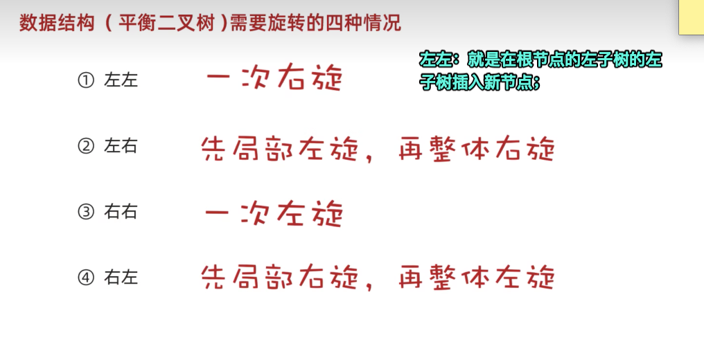

# 「03」面向对象

## 常见七大查找算法

### 简介

基本查找

- 二分查找-插值查找-斐波那契查找

> 前提：数据必须有序
>
> 这些是二分的优化，区别是计算mid的方式不一样

- 分块查找-哈希查找

原则1:块内无序，块间有序

原则2:块数量是数字个数开根号

核心算法：先找在哪一块中，然后在块内找

1.定义一个块类（里面放最大值，起始、结束索引

2.这个类数组里面放全部的块

>  java中的class类就是C++中的结构体

## 常见排序算法

- 冒泡排序、选择排序
- 插入排序

认为前面部分是有序的，后面是无序的，从后面一个一个拿出来比较前面的数字，然后把它插入。

- 快速排序

> （含有递归的算法思想）
>
> 递归的俩个核心
>
> 找出口，找规律
>
> 方法内部再次调用方法的时候，参数必须更加靠近出口

### *递归算法

核心：找出口，找规律

出口：就是一个具体的、到尽头的值

> 比如斐波那契数列，第1和第2的值是1，这个时候就可以用1和2作为出口
>
> If x==1 ||x==2 return 1;

规律：只要写到一次具体的规则，就会重复调用

> 比如斐波那契数列,规律：从3个开始，每一次都是前2个数相加。
>
> Return sum(x-1)+sum(x-2);

{width="300"}

### Ayyays数组API

搜索、拷贝、填充、排序、打印数组

### *特别了解Sort方法

`Sort`是默认基本数据类型升序排序

- 如要按照指定的规则排序或者要引用数据类型进行排序，就要重写排序规则！

`Sort`底层是 `插入排序+二分查找`

其中sort中的排序规则，是一个***接口实现类***，这时候只要用匿名内部类（主要是简化代码

> 如果实现类对象只要用到一次，就可以用匿名内部类的形式进行书写

- Compare的参数

（插入排序+二分查找）

o1是表示在无序序列中便利得到的每一个元素

o2是表示在有序序列中的元素

返回值：正数（0）表示要插入的元素是大的，放在后面。

负数表示，要插入的元素是小的，要放在前面

- Compare 方法的内部

可以按照自己想定义的规则去任意写。

比如：

按照字符串的长度排序 ——`Return o1.length()-o2.length()`

按照字符串内容来排序——`Return o1.getname().compareTo(o2.getname)`


## Lambda表达式

首先引入

```
函数式编程
```

忽略面向对象的复杂语法，强调做什么，而不是谁去做

- Lambda格式

{width="400"}

- 作用

1.能且只能简化函数式接口的匿名内部类的书写

2.让代码更加简洁

> 函数式接口：这个接口有且只有一个抽象方法
>
> @FunctionInterface表示下面的借口是函数式接口

- Lambda省略规则

```
可推导，可省略
```

1.参数类型可以不写

2.如果可以只有一个参数，同时（）也可以省略

3.如果lambda只有一行，大括号，分号，return可以省略不写，需要同时省略。

- 例子用Arrays.sort()，里面参数的匿名内部类试试


## 单列集合Collection

单列集合的顶层接口

{width="400"}


### collection的方法

简单来说就是增、删、查询（查个数，查具体的元素……


> 其中contains（）底层是用equals方法来判断的，所以如果集合中存储的是**自定义类**，就要在类里重写equals方法，否则就是用objects的equals（这个是比较地址值）

### 1.迭代器遍历

`Iterator<E>`

遍历全部元素

```java
while（ iterator.hasnext()){
		object a = iterator.next();
} 
```


> 迭代器类似于指针，不依赖索引

> 注意：
>
> 1.迭代器遍历完毕了，指针不复位，要想复位，就要重新创建对象
>
> 2.在迭代器遍历的时候，不能用集合的方法进行删除和增加。如果实在要删除可以用迭代器的方法remove来删除

### 2.增强for遍历

- 底层就是迭代器
- 作用：简化代码
- 适用范围：所有单列集合和数组才能用
- 格式

```Java
for(元素数据类型 变量名：数组或者集合）{
}
```

>  a是第三方变量，依次表示集合中的每一个数据

- 快捷生成方式：`arr.for`

### 3.Lambda遍历

- 一个方法

```
arr.forEach(consumer函数类接口)
```

> 里面抽象类方法`accept(s)`参数s一次表示集合中的每一个数据

接着可以用Lambda来简化匿名内部类


## List集合接口

- 特点：有序、**有索引**、可重复
- 特有的方法都有参数都是索引


> ListIterator列表迭代器的使用方法和普通迭代器一致，
>
> 不同的是在于它多了往List中增加元素的功能
>
> - 如果在遍历的过程中要删除或者增加元素，不能用集合中的方法来增或者删，必要要用迭代器中的方法

### 基本数据结构

栈、队列、数组、链表

* 数组VS链表
  * 数组：查询快，增删慢
  * 链表：查询慢，增删快

### ArrayList的底层

底层是数组结构的

1. 利用空参创建的集合，在底层创建一个默认长度为0的数组
2. 添加第一个元素时，底层会创建一个新的长度为10的数组
3. 存满时，会创建一个1.5倍的新数组
4. 如果一次添加多个元素，1.5倍还放不下，则新创建数组的长度以实际为准

> TIPS：扩容的意思不是原数组本身可以增加容量，而是创建一个可以容纳更多元素的新数组

### LinkedList的底层

底层是双链表

特点：增删快

内部类 Node（说白了就是结构体）

### 迭代器的底层

底层是一个类似于指针的cursor

一个一个指向下一个元素

### 泛型

- 为什么要引入泛型？

没有泛型，集合就可以存储任意的数据类型，只能用object类来接受集合里面的内容，不能调用子类特有的方法，（注意这个时候强转可能会出现异常）

所以推出了泛型

- 格式`<引用数据类型>`

> 注意一定不能写基本数据类型，
>
> 因为基本数据类型它没有顶级父类Object类，没办法转成Object类

- 作用：就是为了统一数据类型！

> 这就是为什么JAVA是强类型的语言

- 泛型的种类

1. 带有泛型的类`Public class ArrayList<E>{}`

创建该类的时候，E是数据类型

> 里面的E可以写任意字母T……都可以
>
> 有点像C语言中#define datatype int

1. 泛型方法`Public<T>void show(T t)`
2. 泛型接口`Public interface List<E>{}`

- 应用场景

泛型不具备继承性、但是数据具备继承性

> 一句值得品味的话

{width="300"}

{width="300"}

1. 在定义类、方法、接口，如果类型不确定，就可以定义泛型类、方法、接口

> 这个存在弊端，可以接受任意的数据类型，太广了，如果要限定一些类型，这个时候就看·方法2

1. 如果类型不确定，但是能知道以后传递的是

某个继承体系中的，就可以用`泛型的通配符`

- 泛型的通配符

```
？
```

1. `？ Extends E `表示可以传递E所有的子类类型
2. `？ super E` 表示可以传递E所有的父类类型

## set集合接口

### 基本数据结构

二叉树的演变

1. 普通二叉树

弊端：数据不规律，不好查找元素，于是有了`二叉查找树`

2. 二叉查找树

规则：任意节点，左子节点比当前节点小，右子节点比当前节点大

弊端：可能会导致左右树高度差过大的情况，于是出现`平衡二叉树。`

3. 平衡二叉树

规则：*任意节点*左右子树高度差不超过1

引入问题：为什么要旋转？插入新节点，导致树不平衡了，所以就要旋转了

- 平衡二叉树的旋转机制

这里用左旋机制来说明

{width="400"}

- **四种旋转情况

{width="400"}

4. 红黑树

   - 引入：因为平衡二叉树插入节点的时候，左右旋次数太多有时效率不好，所以引入了红黑树
   - 原因：大部分情况下只要改变颜色就可以了，旋转的机会比较少

   - 特点

   1. 是特殊的二叉查找树
   2. 不是高度平衡的
   3. 特有的红黑规则， 每一个节点是红或者黑

   - 5个红黑规则：


{width="500"}

- 默认颜色：默认添加的节点是红色的，效率高
- 添加节点的几种情况以及解决方法

{width="500"}

### 简单认识Set

- 特点

1. 无序、不重复、无索引
2. 方法和collection的API一致

- 遍历方式

迭代器---增强For---lambda表达式

### HashSet

- 组成：数组+链表+红黑树

> JDK8之后的版本是这样的，
>
> JDK8之前是数组+链表

- 哈希值：默认是用地址值取计算出来的

作用：确定元素添加在数组的哪个位置

- hashcode方法

重写这个方法会根据属性值来计算哈希值

- 底层原理

{width="400"}

1. 当链表长度超过8，而且数组长度大于等于64，自动转换成红黑树

2. 如果集合中存储的是自定义对象，就必须要重写hashcode和equal方法。这个是为了去重复

### LinkedHashSet

- 区别：有序
- 作用:能保证存储和取出的顺序一致
- 原理：多了双链表的机制

### TreeSet

- 特点：不重复、无索引、*可排序*
- 底层：红黑树，性能好
- 排序规则：从小到大***（默认）***如果存的是字符，默认是按照字符在ASCII码表中的数字升序进行排序

那我们想怎么对自定义对象进行排序呢？

1. 方法一：

```
实现Comparable 接口
```

重写抽象方法 compareTo

（this表示当前要添加的元素，o表示已经在红黑树中存在的元素 Return this.getAge()-o.getAge();）

1. 方法二：

```
比较器compartor
```

在新建集合对象的时候，自定义Comparator比较器，指定比较规则

{width="500"}

- 什么时候用方法二？

非自定义的类型`integer`和`String`，如果要按照自己的想法给排序，比如长度，可以选他。（如上图所示）

> 因为这个是系统已经封装好，不能去改它的源码

推荐：使用方法一

- 方法返回值的特点：

1. 负数：表示当前要添加的元素是小的，存左边
2. 正数：表示当前要添加的元素是大的，存右边
3. 0表示当前要添加的元素已经存在，舍弃

## 总结单列集合

众多单列集合如何去选择？

{width="400"}

# Map双列集合

{width="400"}

- 特点

{width="400"}

### 常见的API

Map是双列集合的顶层接口

一个概念：键key-值values对

API:增-删-查

- Put方法的细节

Put 添加/覆盖

1.如果添加的时候键不存在，返回的是null

2.在添加的时候如果键已经存在，会把原有的键值对覆盖，返回被覆盖的值

### 1.键找值遍历

1. 通过方法`keySet`把键放到一个单列集合Set中，
2. 遍历单列集合Set得到每一个键，然后利用map集合的键获得对应的值

方法`get（key）`

> 这个遍历Set里面装的是键

### 2.键值对遍历

1. 通过方法`entrySet`把所有的键值对 对象放到一个单列集合Set中
2. 遍历单列集合Set获得每一个键值对对象，然后调用方法`getKey`获得键`getValue`获得值

> 这个遍历Set里面装的是键值对对象，
>
> 也就是把键值对对象抽象了

### 3.Lambda遍历

`forEach`依次得到每一个键和值

下面是样例

{width="400"}

> 这个方法的源码和第二种遍历方式是一样的


### Hashmap

特点：

1. 方法继承map的
2. 键的位置放的是*自定义对象*，要重写equlas、hashcode方法
3. 值的话不用

### LinkedHashMap

特点：有序、不重复、无索引

底层：多了个双链表

### TreeMap

1. 自带排序的
2. 可排序：对键进行排序
3. 默认是按照键的从小到大进行排序，也可以自己规定规则

俩种书写规则，具体看TreeSet板块

## 可变参数

- 引入问题

如果形参的个数是未知的？怎么办

就要引入可变参数

> 底层是数组，是java帮我们创建好的

{width="400"}

## *Collections集合工具类

`shuffle`打乱集合顺序

`addAll`批量添加

`sort`方法：排序

## 集合嵌套

在双列集合中，嵌套的是一个单列集合ArrayList


## Stream流

### 目的

结合了Lambada 表达式，用于简化集合和数组操作的API

### 思想

通过stream()把元素一个一个放在传送带上，一遍一遍通过stream流API简化并过滤掉自己不要的。

### 获得Stream流

- 单列集合Collection获取流
- 双列map获取流
- 数组获取流

{width="400"}

## 中间方法API

{width="400"}

## 终结方法API

{width="400"}

## 收集Stream流

{width="400"}

## 异常

### 概述

- 为什么要用异常

1.如果出现异常，不提前去处理，JVM虚拟机会终止

2.提前处理异常，是让程序更加稳健

- 异常体系

1. 运行时异常：运行时候出现的异常
2. 编译时异常：编译的时候就报错

### 运行时异常

RuntimeException

### 编译时异常

- 作用：

1.是担心程序员技术不行，比如一些很比较复杂的方法内写错，在编译阶段时就爆出一个错误，目的在于提醒不要出错。

- 继承：不是runtimeException，是继承Exception

### 默认异常处理机制

***并不好***，一旦出现真的异常，程序立即死亡！

### 1.处理方法throws


- 流程：方法内报错->抛给调用者->调用者抛给主函数main->main抛给JVM虚拟机->JVM直接杀死程序

> 就是一个没有人管这个异常，都在推卸异常

### 2.try catch

选中一块代码，快捷键`cmd+opt+t`可以快速添加try/catch

### 3.前两者结合

方法体用throw抛给调用者，

调用者用try自己处理异常

规范上是最好的方法

### 自定义异常

Throw：写在函数内的

Throws：写在函数声明的地方

## 日志

### 日志规范

一些接口

1. commons logging
2. Simple Logging Facade for java（简称slf4j-api

### 日志实现框架

- 含义：是别人已经实现了日志规范接口的东西
- 作用：可以把日志信息写到文件或者数据库中，性能较好
- 比如：Logback

### Logback

- 主要分为三个技术模块

core-classic-access 基础模块-log4j的改良模块-有关HTTP的模块

- 快速入门

{width="400"}

- 配置文件xml

{width="400"}

### 日志级别设置

作用：来控制哪些日志不用输出

- TRACE<DEBUG<INFO<WARN<ERROR
- 路径跟踪<调试<关键信息<警告<错误

ALL/OFF：打开全部日志/关闭全部日志

{width="400"}

> - 默认级别是debug，只输出不低于当前级别的日志
>
> -  比如就只写<root> <root level = "ALL">

## File类-IO

### File类

File类可以定位文件：进行删除、获取文本本身信息

>  但是不能读写文件内容

1. File类创建对象

支持相对路径，默认从当前工程下的目录寻找文件

>  文件夹路径的/可能要用转义字符

### 字符集

1. GBK中国标码

一个中文以两个字节的形式存储

2. Unicode

万国码 兼容ASCII编码表

3. UTF-8字符集

中文以3字节形式存储，英文和数字占1个字节

### IO字节输出流

含义：用来读写数据。

字节流、字符流

API：释放资源`close`、`read`


- 举一个例子：

1. 定义一个FileInputStream 对象：is

2. 定一个桶对象放读进来的东西，byte[] buffer = new byte[3]

3. is.read(buffer)读3个字节的内容放到桶中（3个英文字母 or 1个中文汉字）

---


综上效率过低：我们要的是使用输入流一次性读完文件的全部字节，解决乱码问题

官方API：`readAllBytes()`

读完之后，读到的内容都是字节，想要变成想要的字符，需要用new String（Byte [] a）一下

> 本质是char的字符类型的转换 （char）byte

以默认的方式`utf-8`进行解码

### 字节<—>字符

输出的、输入的都是字节

> 字节是人看不懂的，要通过字符集UTF-8来转成字符

字节->字符 new String（Byte [] buffer）

字符->字节 `.getBytes()`byte[] buffer2 = “你好”.getBytes()

### IO字节输入流

outputstream

实现类`Fileoutputstream`

- API：

1. 写`write`
2. 刷新(让写出去的数据生效）`flush`
3. 释放资源（一定要做，会占内存）`close`

- 实现数据追加


### 优雅的资源释放方式

经典做法：`try-catch-finally`


### 字符输出/输入流

- 输出流

> 针对字节流读取中文输出，会出现乱码

`FileReader `

API：`read`

读取一个字符返回，没有可读的字符就返回-1

> 如果参数是字符数组char[]，最后要输出成字符串中文，还是和字节流一样，new String （char[] buffer）=这个代码的意思是字符->字符串

- 输入流

`FileWriter`

API：`Write`

换行：`/r/n`

## 缓冲流

### 基本内容

- 原理：在内存中多了个缓冲池（8Kb），提高原始流读写数据的性能
- 如何构造缓冲流对象

构造参数放原始流：`Bufferinputstream(inputstream xx)`

- 继承的是`Fileoutinput` `Filereader`
- 种类：字节缓冲输入流、字符缓冲输入流
- 使用方式和父类是一样的

### 分类

{width="400"}

### 新增API

1. BufferedReader

`readLine`读一行代码

2. BufferedWrite

`newLine`换行

> 这样就不用自己写\r\n来换行了

## 转换流

只有字符，没有字节的！！

### 基本内容

**问题** ：当文件和代码编码不一致的时候，会出现乱码

```
InputStreamReader
OutputStreamWrite
```

{width="400"}

## 使用方式

`public InputStreamReader(InputStream is,String charset)`

可以指定编码把原始字节流转换成字符流，如此字符流中的字符不乱码


原始字节流-->转换字符流-->缓冲流

inputstream   inputstreamReader bufferReader

> 同理outputstreamReader

## 对象（反）序列化

### 序列化

- 含义：将对象存到磁盘文件中
- 实现的流：`ObjectOutputStream`


- 必要的条件：该对象必须要实现序列化接口`Serializable`
- 构造对象输出流：`ObjectOutputStream(new OutputStream())`
- API：`writeObject（Object o）`

### 反序列化

- 含义：将对象从磁盘读到内存中
- 构造对象输出流：`ObjectInputStream(new InputStream())`
- API:`ReadObject（）`
- 版本号（了解）：

## 打印流

`PrintStream`

`PrintWriter`

## Properties

作用

* 可以存储Properties的属性集的键值对数据到属性文件中去

  `store`

* 可以加载属性文件中的数据到Properties对象中来

  `load`


## 多线程

### 创建方式123

- 方法一：继承Thread类

1.定义一个线程类，继承`Thread`类，重写`run`方法

2.在main中创建对象，用`start（）`方法来启动线程

> 缺点：不能继承其他类，不利于扩展

- 方法二：实现`MyRunnable`接口

1.实现接口，重写run方法

2.创建对象

3.把对象交给Thread线程对象

4.调用`start（）`方法

> 优点：可以继承别的类，实现多个借口
>
> 缺点：不能返回结果

- 方法三：实现`callable`接口

1.实现callable接口，重写`call`方法

2.创建对象，把Callable对象交给`FutureTask`对象（是Runnable对象，可以交给Thread）

3.再把FutureTask对象给`Thread`

4.最后Thread对象就可以`Start()`开启线程,`FutureTask`可以用`get`方法获得call方法的结果返回值

> 优点：有返回值

### Thread常用方法

设置线程名字--获得名字--获得当前线程--休眠方法

`start`启动线程

## 线程同步

### 概念

- 问题：解决线程安全问题
- 核心：加锁，让多个线程依次访问共享资源。

### 方法实现123

- 方法一、同步代码块`Synchronized`来封装主要代码

1. 同步锁对象

实例方法建议用this作为锁对象

静态方法建议用字节码类名.class 作为锁对象

- 方法二、同步方法

1. 格式

   Synchronized写在返回值类型的前面

2. 原理：每次只能一个线程进入，执行完毕后自动解锁，其他线程才能进来执行

3. 实例方法默认是this

静态方法默认是xx.class

- 方法三、Lock锁

​	`ReetrantLock`

## 线程池

### 基本操作

- 问题：创建新线程开销太大了，影响系统性能
- 解决：`ExecutorService`接口，实现类`ThreadPoolExecutor`

{width="400"}

- 如何得到线程池对象

`ThreadPoolExecutor` 来创建一个线程池对象

- 线程池启动的API

```
execute
```

###  Executors工具类

通过工具类来创建线程池

>  存在风险。没有限制任务数量，会导致资源耗尽。不建议使用

### 定时器

```
ScheduledExecutorService
```

- 定时器（其实是一个线程池）
- API : `scheduleAtFixedRate`

### 并发和并行

> 参考好文 [并发和并行的区别](https://cloud.tencent.com/developer/article/1424249)

- 并发

1. 在操作系统中，是指一个时间段中有几个程序都处于已启动运行到运行完毕之间
2. 由于CPU切换的速度很快，给我们的感觉是这些线程在同时执行。这就是并发

- 并行

1. **并行（Parallel），当系统有一个以上CPU时，当一个CPU执行一个进程时，另一个CPU可以执行另一个进程，两个进程互不抢占CPU资源，可以同时进行，这种方式我们称之为并行(Parallel)。**

- 区别：

1. **并发是指在一段时间内宏观上多个程序同时运行。并行指的是同一个时刻，多个任务确实真的在同时运行。**
2. 并发的多个任务之间是互相抢占资源的。   并行的多个任务之间是不互相抢占资源的。
3. 只有在多CPU的情况中，才会发生并行。否则，看似同时发生的事情，其实都是并发执行的。

## 网络通信三要素

### IP地址

- 含义：

定位上网设备的唯一标志。

常见的有IPv4 IPv6

- 域名：例如www.baidu.com
- dns服务器:（解析域名->IP地址）
- IP地址形式：公网地址、私有地址（局域网使用）
- IP常用命令

`ipconfig`查看本机IP地址

`Ping ip地址`：检查网络是否连通

- 特殊IP

```
本机IP：127.0.0.1` 或者`localhost
```

### IP地址类

```
InetAddress
```

- 获取对象：静态方法`getxxxx`

比如：获取本机IP `getLocalHost`

- API：获取主机名字、获得IP地址

### 端口号

- 含义：程序在计算机上的标识

### 协议

- 含义：连接和通信数据的规则
- 传输层常见的协议：TCP 、UDP
  -  TCP是可靠的协议，但通信效率低

  -  UDP是面向无连接，不可靠传输的通讯协议

### UDP

- 特点：无连接、不可靠传输
- 过程：注册端口—创建数据包对象接受数据Packer ——端口对象调用接收方法（参数是Packer）
- UDP的接受端可以接受很多发送端的消息，因为只负责接受数据包，无所谓是哪个发送端的数据包

### TCP

- 含义：是一种面向连接、安全、可靠的协议
- TCP模型：客户端==Socker===服务端      通过IO流来输入输出数据
- 客户端基本操作

Socker管道对象（用来请求与服务端连接）

调用它的`getoutStream`方法得到字节输出流，字节输出流->高级打印流

- 服务端基本操作

ServerSocket类-服务端端口

调用它的`accept`方法来建立管道Socker，返回的是Socket对象

用socket调用方法得到字节输入流 ->转换流->缓冲字符输入流

- 让服务端可以处理多个客户端的通信需求

利用`多线程`

*每收到一个管道，交给一个独立的子线程负责读取消息*

- 利用多线程来优化上面的代码

## Junite单元测试

针对JAVA方法的测试，进而检查方法的正确性。

问题：main不能得到测试的结果报告，不能自动化测试

引入：Junit单元测试

- 作用：可以生成全部方法的测试报告

如果某个方法测试失败了，不会影响其他方法的测试

- 快速入门

1. 编写测试方法：公共的无参数无返回值的非静态方法
2. @Test注解：标注该方法是一个测试方法
3. 有返回值的方法，要写Assert断言，调用类的静态方法（失败消息，期待值，实际值）

> Junit框架jar包 是IDE自带的

## 反射

### 基本操作

得到编译后class文件的对象

1. 反射第一步：获得Class对象

方法：

1.静态方法forName

2.类名.class

3.对象.class

1. 第二步获得构造器对象or变量对象or方法对象

2.1获得构造器对象

getDeclaredConstructors（）拿到所有构造器

2.2利用构造器对象，创建对象

```
newInstance
```

>  私有构造器、方法、变量，要打开权限，setAccessible（true）

1. 获得成员变量对象

getDeclareedFields()

3.1利用成员变量赋值

```
set
```

3.2利用对象取值`get`

1. 得到成员方法对象

getDeclaredMethods()

4.1触发方法

```
invoke
```

### 反射的作用

1.绕过编译阶段为集合添加数据

2.做通用框架的底层原理

## 注解

作用：对类、方法、变量做标记，然后进行特殊处理

## 动态代理

Proxy

学不懂。。

作用：提高代码复用性

## XML

- 定义：可扩展标记语言，用于自定义数据格式
- 使用场景：存储和传输数据、作为软件的配置文件
- 第一行：必须是文档规则
- XML标签规则：

<name>

这里面写你要的内容

</name>

- 扩展

1.  注释：<!- - xxxxxxxxx - ->
2. 特殊字符：
3. CDATA区：里面就不会出现冲突～～


### XML解析技术

Dom4j

是用树的方法来解析的

### XML检索技术

XPath

绝对路径、相对路径、全文查找、属性查找

> 下面是绝对👇路径的一些使用

SAXReader解析器-》Document-〉调用方法（）-》得到元素element-〉调用元素的各种方法得到自己想要的东西

## 设计模式

1. 工厂设计模式

就是一种代码的设计模式

和现实吻合

1. 装饰设计模式

在不改变原类的基础上，动态地扩展新的功能