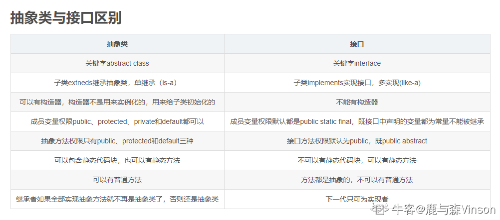
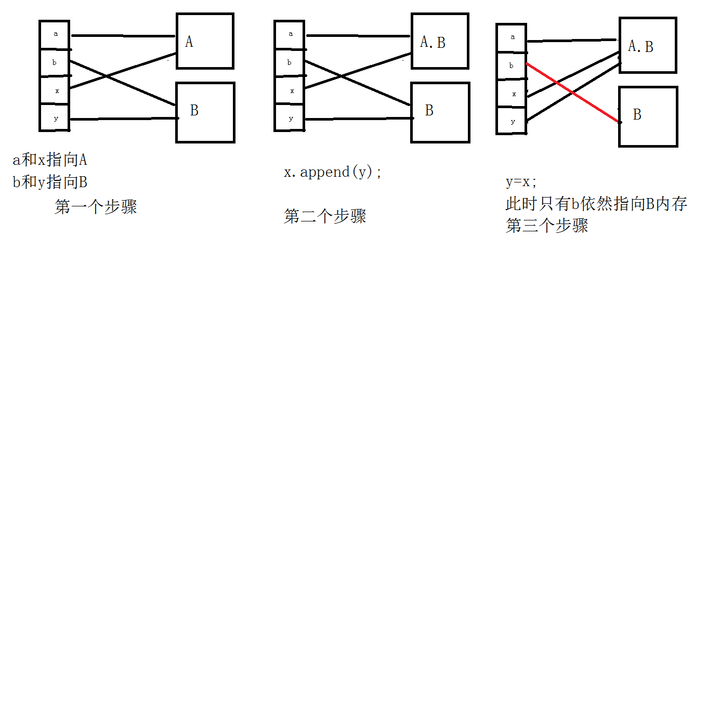
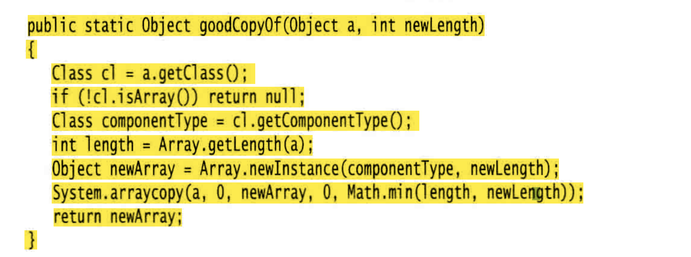

# Java核心技术卷I 笔记

## 1.抽象类和接口

{width="700"}

1. java抽象类的构造方法和普通类的构造方法一样都是用来初始化成员变量的

2. 抽象类是一个父类的作用

## 2.默认方法default

默认方法允许我们在接口里添加新的方法，而不会破坏实现这个接口的已有类的兼容性。

也就是说不会强迫实现接口的类实现默认方法。

## 3.char类型

char 类型的值可以表示为十六进制值，其
范围从\u0000 到 \Uffff

* 例如：W2122 表示注册符号 ( ), \u03C0 表示希腊字母PI

> 要加转义序列 \u 

## 4.类常量

经常希望某个常量可以在一个类中的多个方法中使用，用关键字static final 来定义类常量

## 5.Switch

case标签，java SE7后面可以是字符串字面量

## 6.带标签的break

用于跳出多重循环

```java
xxxx:
while{
​		for{
​			`break xxxx;`
		}	
}
```


## 7.创建数组，未初始化

里面放的是null

`String[] names = new String[10];`

## 8.数组工具类Arrays

1. 更简单方法打印数组中所有的值

`Arrays.toString(a[])`

2. 数组拷贝

`Arrays.copyOf(老数组,新数组的长度*n)`

3. 数组排序

`Arrays.sort`优化的快速排序

4. 比较数组是否相等

`Arrays.equals(type[]a,type[]b)`

5. 数组中全部元素填充成一样的`fill`

6. 二分查找`binarySearch`

## 9.命令行参数String arg[]

在命令行中运行java程序时，后面带的参数，都会被放进arg数组中

`Java Message -g cruel world`

```java
args[0]="-g"

arg[1]="cruel"

arg[2]="world"
```


## 10.静态变量的定义范围

静态变量只能在类主体中定义，不能在方法中定义

## 11.精度的细节

1. float的正式定义:加后缀f

`float f = 1.0f`

> Float f = 1 也是可以的，这是把int转成float ，由于java的特性，就不需要再强制转换了

2. 多个精度的数字运算，最后结果以最高精度为准


3. Java基本数据类型转换：

**`byte、short、char`—>`int`—>`long`—>`float`—>`double`**

**由低精度到到精度可以自动转换，而高精度到低精度会损失精度，故需要强制转换。**

## 12.静态初始化代码块>构造代码块>构造方法

1. 静态代码块：是在类的加载过程的第三步初始化的时候进行的，主要目的是给类变量赋予初始值。

2. 构造代码块：是独立的，必须依附载体才能运行，Java会把构造代码块放到每种构造方法的前面，用于实例化一些共有的实例变量，减少代码量。

3. 构造方法：用于实例化变量。

>  1是类级别的，2、3是实例级别的，自然1要优先23.

## 13.匿名内部类无构造器

由于构造器的名字必须与类名相同，而匿名类没有类名，所以匿名类不能有构造器。

## 14.++y 和y++

`++y`是先加再运行

`y++`是先运算再加

## 15.抽象类

* 抽象方法是仅声明，并不做实现的方法


* 抽象类必须被继承才有意义，因此不能被`final`修饰

## 16.java中的调用 值调用、引用调用

1. 基本数据类型。方法里工作的是原对象引用的拷贝，是按值传递的，传进来是一个副本，比如String、基本数据类型啊

2. 引用数据类型。也就是传入的参数，是新建的一个对象，（也就是一个指针），指向的地址是和原参数一样的。

**所以如果我们想改变内容，一定要改变内存中的值，而不是改变地址**

往方法中传参，传的仅仅只是地址，而不是实际内存，所以不要以为y=x程序的执行，是 b=a的执行。这两者是不相等的

{width="66%"}

* 总结：

  1. 一个方法不能修改一个基本数据类型的参数（数值型、布尔型）

  2. 一个方法可以修改一个对象参数的状态

  3. 一个方法不能让对象参数引用一个新的对象

  4. String类是不可变类，不能修改
  5. 数组是引用传递,传入方法内的是一个引用，因此方法结束后，会改变。

## 17.默认域初始化

如果在构造器中没有给域初始化，那么就会自动赋默认值

布尔值false、 对象引用为null 、数值为0

> 但是不初始化，是一个坏习惯

## 18.初始化块

无论用哪个构造器构造对象，首先运行初始化块，然后才运行构造器的主体部分。

## 19.静态域

`静态域`是类中的`静态初始化块`

**是在类第一次加载的时候，会执行一次。**

之后再通过类创建第二个对象，就不会再执行了

`Static{ }`

## 20.包的命名

sun公司建议把公司的因特网域名逆序，

比如com.baidu是一个大包

子包`com.baidu.xxx`

## 21导包

如果俩个包内有同名的类data

可以用`包名.`的方式来使用

## 22.将类放入包内

`package com.baidu.xxx`

否则，类就放在默认包里defaulf package 

## 23.方法注释

`@param`变量

`@return`描述

`@throws`类描述

## 24.通用注释

`@see`引用超链接

一定要使用井号（#，) 而不要使用句号（.）分隔类名与方法名，或类 名与变量名

## 25.类设计技巧

1. 一定保证数据私有

2. 一定要数据初始化

3. 不要在类中使用过多的基本类型

> 就是用其他的类代替多个相关的基本类型的使用，比如有字符串类型的街道、城市、州，这些都可以放到Address类中，即就定义一个Address类型就好了

4. 不是所有的域都需要独立的域访问器和修改器

> 就是有些成员变量初始化之后，就固定下来了，在现实中是不能修改的或者查询的。就是不能有set和get方法

5. 一个类中不能有太多复杂的方法。

把它分解成两个更为简单的类

6. 类名和方法名要体现他们的职责

7. 优先使用不可变的类

> 什么是不可变的类？就是在创建对象后，不可以修改其字段的值。比如String，如果要修改"hello"->"world"，就要再创建一个对象了

* 如何创建不可变类
  1. 就是用final去修饰字段，并且不提供set方法
  2. private，提倡公共的set get方法


* 不可变类的好处

  - 它们是线程安全的，因为它们不能被修改。

  - 它们可以被轻松地共享和缓存，因为它们不能被修改。

  - 它们更容易调试，因为它们不会受到其他代码的影响。


## 26. Java工具

java.exe是java虚拟机

javadoc.exe是用来制作java文档的

jdb.exe是java的调试器

javaprof.exe是剖析工具

## 26.HashMap

key和value允许为null

其他的Map不可以

## 27.修饰符作用范围

`public`>`protected`>`default`>`private`

* `public`可以被当前类，子类，包，其他包，访问，

* `protected` 可以被当前类，子类，包访问 

* `default`可以被可以被当前类，包内访问；

*  `private`只能被当前类访问

## 28.字符串常量池和堆栈区

**1. 直接赋值而不是使用new关键字给字符串初始化，在编译时就将String对象放进字符串常量池中；**

**2. 使用new关键字初始化字符串时，是在堆栈区存放变量名和内容；**

**3. 字符串的拼接操作在程序运行时，才在堆中创建对象。**

4. **一般，可以认为使用==比较的是引用，equals比较的是内容**

## 29.多态中成员变量和成员方法

* 成员变量：编译看左边，运行也看左边

* 成员方法：编译看左边，运行看右边

## 30.JAVA反射机制

* 作用 

  * 在运行时判断任意一个对象所属的类；

  * 在运行时构造任意一个类的对象；

  * 在运行时判断任意一个类所具有的成员变量和方法；

  * 在运行时调用任意一个对象的方法


反射机制使得人们可以通过在运行时查看域和方法， 让人们编写出更具有通用性的程序。

## 31.方法重析

对多个重载的方法进行参数类型匹配

## 32.阻止继承：final类和方法

希望阻止人们利用某个类定义子类。不允许扩展的类被称为 `final 类`。

final类所有的方法自动成为`final方法`


重载的实现是编译器根据函数的不同的参数表，对同名函数的名称做修饰，那么对于编译器而言，这些同名函数就成了不同的函数。被final修饰的类可以被重载但不能被重写

## 33.Protected关键字

子类就可以调用父类的方法

propected在default的基础上多了一个其他包的继承子类也可以访问. 

**所以记得受保护的比不写要大一点点**

## 34.getClass()方法

1. `getClass()` 方法用于返回对象的运行时类。运行时类是指对象在JVM中实际上的类型，这可能会与对象的声明类型不同.

2. 你可以使用 `getClass()` 方法来获取对象的类型信息，以便在运行时进行类型检查或进行其他操作。

3. 类型检查例如，假设你有一个方法，它接受一个 `Object` 类型的参数，但你希望它只能接受特定类型的对象。你可以使用 `getClass()` 方法来确保对象是期望的类型

```java
public void myMethod(Object obj) {
   if (obj.getClass() == MyExpectedClass.class) {
      // obj is of the expected type, so do something with it
   } else {
      // obj is not of the expected type, throw an exception or do something else
   }
}
```


## 35.instanceof和getClass区别

`instanceof` 操作符通常用于检查对象是否属于特定的类型（或其子类），而 `getClass()` 方法则用于获取对象的运行时类型。

## 36.equals和hashCode

如果重新定义 `equals`方法，就必须重新定义 `hashCode` 方法， 以便用户可以将对象插入 到散列表中

## 37.随处可见toString方法原因

只要对象与一个字符串通过操作符“ +” 连接起 来，Java 编译就会自动地调用`toString`方法，以便获得这个对象的字符串描述。

## 38.编写一个完美equals方法

1. 显式参数命名为 `otherObject`, 稍后需要将它转换成另一个叫做 other 的变量。 

2. 检测 this 与 otherObject 是否引用同一个对象： `if (this = otherObject) return true; `这条语句只是一个优化。实际上，这是一种经常采用的形式。因为计算这个等式要比一 个一个地比较类中的域所付出的代价小得多。 

3.  检测 otherObject 是否为 null, 如 果 为 null, 返 回 false。这项检测是很必要的。` if (otherObject = null) return false; `

4. 比较 this 与 otherObject 是否属于同一个类。如果 equals 的语义在每个子类中有所改 变，就使用 getClass 检测： `if (getClass() != otherObject.getCIassO) return false;` 如果所有的子类都拥有统一的语义，就使用` instanceof `检测： `if (!(otherObject instanceof ClassName)) return false; `

5. 将 otherObject 转换为相应的类类型变量： `ClassName other = (ClassName) otherObject `

6. 现在开始对所有需要比较的域进行比较了。使用 =比较基本类型域，使用 equals 比 较对象域。如果所有的域都匹配， 就返回 true; 否 则 返 回 false。

## 39.ArrayList动态更改数组大小

核心：不是扩容，是再创建了一个更大的数组

1. 如果调用 add 且内部数组已经满了，数组列表就将自动地创建一个更大的数组，**并将所有的对象从较小的数组中拷贝到较大的数组中。**


2. 如果已经清楚或能够估计出数组可能存储的元素数量,可以把初始容量传递给 ArrayList 构造器,然后调用 n次 add, 而不用重新分 配空间。

​	`	ArrayList<student> AL = new ArrayList<>(n)`

3. 一旦能够确认数组列表的大小不再发生变化，就可以调用 `trimToSize方法`。这个方法将 存储区域的大小调整为当前元素数量所需要的存储空间数目。垃圾回收器将回收多余的存储 空间。

## 40.自动装箱和自动拆箱

1. 为了便于添加int类型的元素到Array<integer> List中，就会进行`自动装箱``List.add(3)`将自动变成`List.add(Integer.valueOf(3))`

2. 相反，把一个Integer对象赋给一个int的时候就会自动拆箱`int n = List.get(i)`自动变成 `int n = List.get(i).intValue();`


如果在一个条件表达式中混合使用 Integer 和 Double 类型， Integer 值就会拆箱， 提升为 double, 再装箱为 Double:

`Integer n = 1; Double x = 2.0; `

`System.out.println(true ? n : x); // Prints 1.0`

## 41.Integer.parselnt解析字符串成整型数值

`static int parselnt(String s) `

` static int parseInt(String s,int radix) `

返回字符串 s 表示的整型数值， 给定字符串表示的是十进制的整数（第一种方法，) 或者是 radix 参数进制的整数（第二种方法 。


`valueOf` 是把字符串变成Integer类型的变量

## 42.参数数量可变的方法

形参使用`...`

```java
public static double max(double... values){

Double lagest = Double.NEGATIVE_INFINITY;

For(double v :values){

If(v>largest) largest =v ;

}

return largest;
}
```


## 43.JAVA的编码方法

一律是`Unicode`编码方式

每个字符无论中文还是英文都占用2个字节


Java虚拟机中通常使用UTF-16来保存一个char类型字符

## 44.利用反射来分析类的能力

Class类中的 getFields、 getMethods 和 getConstructors 方 法 将 分 别 返 回 类 提 供 的 public 域、 方法和构造器数组， 其中包括超类的公有成员。Class 类的 getDeclareFields、 getDeclareMethods 和 getDeclaredConstructors 方法将分别返回类中声明的全部域、 方法和构 造器， 其中包括私有和受保护成员，但不包括超类的成员。

`getModifiers `的方法， 它将返回一个整型数值，用描述 public 和 static 这样 的修饰符使用状况。再使用`Modifier.toString(m.getModifiers())` 把这个数值解析成修饰符的String类型，就可以打印出来。


即可以打印一个类的全部信息的方法：所有构造器、方法、成员变量（域）

---

* 在运行时使用反射查看对象的域

  1. 通过 Class 对象调用 getDeclaredFields，获得Field对象f

  2. 反射机制的默认行为受限于 Java 的访问控制。然而， 如果一个 Java 程序没有受到安 全管理器的控制， 就可以覆盖访问控制。 为了达到这个目的， 需要调用 Field、 Method 或 Constructor 对象的 setAccessible 方法。`f.setAccessible(true)`
  3. 调用f的`get`方法，获得域的值

## 45.对象转换问题

可以子类临时转到Object类，再转换回来是可以的。

但是一直Object类是不能直接转换成子类的

## 46.利用Class反射来制作"创建数组副本的方法"

1. 获得数组的类class对象

2. 利用class对象获得数组类型的class对象

3. 获得原数组的长度Array.getLength(原数组)

4. 利用长度和数组类型，创建一个新的空数组对象

5. 利用System.arraycopy方法复制内容

{width="300"}

* 理解：当然这些都可以通过Arrays.copyof方法直接拷贝，这个Class反射应该就是制作底层工具的

## 47.利用反射调用任意方法

1. 利用Class对象获得method对象

2. 利用method对象的方法invoke可以调用方法

## 48.写出一个完美的继承

1. 将公共操作和域放在超类

2. 不要使用受保护的域

>  第一，子类集合是无限制的， 任何一个人都能够由某个类派生一个子类，并 编写代码以直接访问 protected 的实例域， 从而破坏了封装性。
>
> 第二， 在 Java 程序设计语言 中，在同一个包中的所有类都可以访问 proteced 域，而不管它是否为这个类的子类。

3. 使用继承实现“ `is-a`” 关系

就是子类要包含父类的所有属性的前提之下，可以有自己独特的属性。

子类不可以不含父类的某个属性，这是不能使用继承的

4. 除非所有继承的方法都有意义，否则不要使用继承

5. 在覆盖方法时，不要改变预期的行为

   就是在重写方法的时候，不能改变原父类方法的本意。

   比如父类addSalary方法原本是为了增加薪水，子类不能在覆盖重写方法之后，把目的变成了减少薪水

6. 使用多态， 而非类型信息

两个方法如果是相同的概念，就应该为这个概念定义一个方法， 并将其放置在两个类的超类或接口中

7. 不要过多地使用反射

反射是很脆弱的， 即编译器很难帮助人们发现程序中的错误， 因此只有在运行时才发现错误并导致异常。

## 48.String.split

按指定分隔符对字符串分割成字符串数组

返回字符串数组

## 49.类中的静态方法、变量优先加载

当实例化该类，静态方法和变量会优先加载且加载一次。

可以用对象调用静态方法，不会出错，但是我觉得这是一种愚蠢的行为。

## 50.接口中的修饰符

接口中方法自动都是public

当然在实现接口的时候必须是public


接口中的public方法，如果实现了这个接口，就必须在这个类中实现这个方法


## 51.泛型Comparable接口

可以为泛型 Comparable 接口提供一个类型参数。

这样对 Object 参数进行类型转换总是让人感觉不太顺眼， 但现在已经不见了。


使用Arrays类中的sort方法，实现自定义对象的排序，就必须实现Comparable接口

## 52.JAVA是强类型语言

在调用方法的时 候， 编译器将会检查这个方法是否存在

## 53.接口的特性

1. 不能new实例化创建接口对象，却能声明接口的变量。

接口的变量必须引用实现了接口的类对象

2. 可以用`instanceof`来检查一个对象是不是实现了某个特定的接口

`if( a instanceof Comparable)`


3. 接口可以用`extends`来扩展另一个接口

4. 接口中的不能包含实例域，但是可以有常量

`double a= 1.1`

5. Java SE 8 允许在接口中增加静态方法


6. 解决接口中默认方法冲突

   1. 实现了俩个接口，这俩个接口中有俩个同名的方法，产生二义性错误

      解决：此时这个实现类，需要提供一个同名的方法，可以在这个方法内选择一个接口中的方法。**用. `接口名.super.`的方法**

   2. 继承了一个超类，同时实现了一个方法，超类和方法中有同名的方法这时只会考虑超类方法，**这是“类优先”规则**

## 54.JAVA中的编码

采用unicode编码，两个字节表示一个字符

char类型占2个字节，int占4个字节。

## 55.对象克隆

* 问题存在：一个对象建立副本，这时原变量和副本都是同一个对象的引用，任何一个变量改变都会影响另一 个变量。


如果希望copy是一个新对象，它的初始状态与 original 相同， 但是之后它们各自会有自 己不同的状态， 这种情况下就可以使用 `clone `方法。

但是Object自带的clone是`浅拷贝`，且是Protect类型的(只能在子类中调用，对象不能调用），只能对基本数据类型生效

必须重新定义 clone 方法来建立一个`深拷贝`

`Cloneable 接口`

* 如何建立深拷贝：实现接口，Protected->public ，再调用父类方法的clone,再类型转换

​	super.clone

​	其他引用数据类型，要再单独调用一次比如：(Date)super.clone()

## 56.函数式接口

对于只有一个抽象方法的接口，就叫函数式接口

## 57.Lambda

(参数)->{方法体}

## 58.内部类

内部类方法可以访问该类定义所在的作用域中的数据， 包括私有的数据。 

•内部类可以对同一个包中的其他类隐藏起来。 

•当想要定义一个回调函数且不想编写大量代码时，使用匿名 （anonymous) 内部类比较 便捷。

> 好像没什么用

## 59.使用异常机制的技巧

1. 异常的基本规则是：只在异常情况下使用异常机制。

捕获异常用的时间很多

2. 不要过分细化异常

就是用很多try catch

## 60.认识常用的基本｜引用数据类型

* 基本数据类型都有一个引用类型

​	比如Float是float的引用类型

* 特点是：首字母大写

* 总结：基本数据类型是小写，引用是大写

## 61.is-a 和has-a和like-a区别

根据英文直译也可以看出:

* A is-a B:A是一个B，表示A是B的子类，这样A才能称作是一个B

* A like-a B:A好像是一个B，表示A实现了B这个接口

* A has-a B:A有一个B，表示A是B的父类，这样才能称作A有一个B

## 62.泛型类型之间没有继承关系

## 63.修饰符final

final意思是最终，不能被继承

**不能和abstract同时作为一个类的修饰符**

abstract修饰一个类，这个类肯定可以被继承，但是final类是不能继承的，所以有矛盾，肯定不能同时用

## 64.异常中的finally什么时候执行

当在catch中，用throw抛出异常之后，就只会执行finally中的代码，执行完程序结束。

## 65.default和protected区别

<https://www.nowcoder.com/questionTerminal/fe708884a2074763b6d5d1dd62a52817>

来源：牛客网


* `default`和`protected`的区别是： 

​		前者只要是外部包，就不允许访问。 

​		后者只要是子类就允许访问，即使子类位于外部包。 

* 总结：default拒绝一切包外访问；protected接受包外的子类访问

## 66.Object中的equals方法

原生的equals方法中定义的参数是Object类型，也就是说只要是Object类型，返回的就是true

## 67.父类中只有有参构造函数情况


链接:<https://www.nowcoder.com/questionTerminal/d488a0252da14875a6607d94579b802b>
来源：牛客网


**子类的构造方法总是先调用父类的构造方法**，如果子类的构造方法没有明显地指明使用父类的哪个构造方法，子类就调用父类不带参数的构造方法。

而父类没有无参的构造函数，所以子类需要在自己的构造函数中显式的调用父类的构造函数。

> 父类有有参构造器，java就不会默认给无参构造器

父类没有**无参**的构造函数，有有参构造器，所以子类需要在自己的构造函数中显式调用父类的构造函数

## 68.类的加载顺序

链接<https://www.nowcoder.com/questionTerminal/3910188b1259470a9bb7109885ed48c8>
来源：牛客网


1. 首先，需要明白**类的加载顺序**。 

(1) 父类静态对象和静态代码块

(2) 子类静态对象和静态代码块 

(3) 父类非静态对象和非静态代码块

(4) 父类构造函数

(5) 子类 非静态对象和非静态代码块

(6) 子类构造函数

其中：类中静态块按照声明顺序执行，并且(1)和(2)不需要调用new类实例的时候就执行了(意思就是在类加载到方法区的时候执行的)

2. 因而，整体的执行顺序为 

public static Test t1 = new Test();     //(1)

static 
{
System.out.println("blockB");        //(2)

} 

Test t2 =new Test();               //(3)

在执行(1)时创建了一个Test对象，在这个过程中会执行非静态代码块和缺省的无参构造函数，在执行非静态代码块时就输出了blockA；然后执行(2)输出blockB；执行(3)的过程同样会执行非静态代码块和缺省的无参构造函数，在执行非静态代码块时输出blockA。


> 执行顺序优先级：静态块>main()>构造块>构造方法 

## 69.迭代器

作用：依次访问集合中的元素的


## 70.接口扩展另一个接口

关键词`extends`

## 71.链表和普通数组的区别

链表：尽可能减少插入和删除元素时付出的代价

数组：方便查找

## 72.属性映射property map

* `property map`是一种存储键 / 值对的数据结构。属性映射通常用来存储配置 信息，

* 它有 3 个特性： 
  * 键和值是字符串。 
  * 映射可以很容易地存人文件以及从文件加载。
  * 有一个二级表保存默认值。

## 73.多进程和多线程区别

* 本质的区别在于每个进程拥有自己的一整套变 量， 而线程则共享数据。

这听起来似乎有些风险， 的确也是这样， 在本章稍后将可以看到这 个问题。然而，共享变量使线程之间的通信比进程之间的通信更有效、 更容易。 此外， 在有 些操作系统中，与进程相比较， 线程更“ 轻量级”， 创建、 撤销一个线程比启动新进程的开销要小得多。

## 74.中断线程

1.没有强制线程终止的方法。但是有interrupt方法可以请求终止线程

2.检测线程中断状态，`isinterrupt`方法

3.一个被阻塞的线程（sleep或者wait）没办法检测中断状态，会有Interrupted Exception 异常中断。

## 75.线程状态

线程可以有以下6种状态：

1.New新创建

2.Runnable可运行

3.Blocked被阻塞

4.Waiting等待

5.Timed waiting 计时等待

6.Terminated 被终止

> 要确定一个线程的当前状态，可以调用getState方法

👇介绍每种状态

1)该线程还没有开始运行。这意味 着它的状态是 new。

2）一旦调用 start 方法，线程处于 runnable 状态。

3）当一个线程试图获取一个内部的对象锁（而不是 javiutiUoncurrent 库中的锁，) 而该 锁被其他线程持有， 则该线程进人阻塞状态，当所有其他线程释放该锁，并且线程调度器允许 本线程持有它的时候，该线程将变成非阻塞状态。

4）当线程等待另一个线程通知调度器一个条件时，它自己进入等待状态。我们在第 14.5.4 节来讨论条件。在调用 Object.wait 方法或 Thread.join 方法， 或者是等待 java, util.concurrent 库中的 Lock 或 Condition 时， 就会出现这种情况。

5）有几个方法有一个超时参数。调用它们导致线程进人计时等待（ timed waiting ) 状 态。这一状态将一直保持到超时期满或者接收到适当的通知。带有超时参数的方法有 Thread.sleep 和 Object.wait、Thread.join、 Lock,tryLock 以及 Condition.await 的计时版。

6）因为run方法正常退出而自然死亡；因为一个没有捕获的异常终止了run方法而死亡，比如stop方法杀死线程，但是stop方法已经过时


## 76.线程优先级

当虚拟机依赖于宿主机平台的线程实现机制时， Java 线程的优 先级被映射到宿主机平台的优先级上， 优先级个数也许更多，也许更少。

Windows,Linux上都不一样

可以用 setPriority 方法提高或降低任何一个线程的优先级。可以将优先级设 置为在 MIN_PRIORITY (在 Thread 类中定义为 1 ) 与 MAX_PRIORITY (定义为 10 ) 之间的 任何值。

## 77.锁对象

防止代码块受并发访问的干扰

Java语言提供一个 `synchronized` 关键字达 到这一目的，

并且 Java SE 5.0 引入了 `ReentrantLock `类。


这一结构确保任何时刻只有一个线程进人临界区。一旦一个线程封锁了锁对象， 其他任何线程都无法通过 lock 语句。当其他线程调用 lock 时，它们被阻塞（也就是进入阻塞状态 见75），直到第一个线程释放 锁对象。


当然，使用公平锁比使用常规锁要慢很多。

## 78.Condition条件类

可以接触 等待集中 线程的阻塞状态

`signalAll()`解除所有线程

`signal()`随机选择一个线程解除

**总结有关锁和条件的关键之处：**

 •锁用来保护代码片段， 任何时刻只能有一个线程执行被保护的代码。 

•锁可以管理试图进入被保护代码段的线程。

 •锁可以拥有一个或多个相关的条件对象。

 •每个条件对象管理那些已经进入被保护的代码段但还不能运行的线程

## 79.内部锁 同步方法synchronized关键字

要调用该方法，线程必须获得内部的对象锁。

内部对象锁只有一个相关条件。wait 方法添加一个线程到等待集中，notifyAll /notify方法解除等待线程的阻塞状态。


## 80.死锁

死锁含义：有可能会因为每一个线程要等待更多的钱款存入而导致所有线程都被阻塞。

Java 编程语言中没有任何东西可以避免或打破这种死锁现象。必须仔细设计 程序， 以确保不会出现死锁。

## 81.阻塞队列

使用队列，可以安全地从一个线程向另 一个线程传递数据。例如，考虑银行转账程序， 转账线程将转账指令对象插入一个队列中， 而不是直接访问银行对象。


当试图向队列添加元素而队列已满， 或是想从队列移出元素而队列为空的时候， 阻塞队 列（blocking queue ) 导致线程阻塞。在协调多个线程之间的合作时，阻塞队列是一个有用的 工具。

## 82.线程安全的集合

ConcurrentHashMap、 ConcurrentSkipListMap > ConcurrentSkipListSet 和 ConcurrentLinkedQueue。

这些集合使用复杂的算法，通过允许并发地访问数据结构的不同部分来使竞争极小化。

如果多个线程修改一个普通的 HashMap，它们会破坏内部结构 （一个链表数组）。有些链接可能丢失， 或者甚至会构成循环，使得这个数据结构不再 可用。对于 ConcurrentHashMap 绝对不会发生这种情况。


从 Java 的初始版本开始，Vector 和 Hashtable 类就提供了线程安全的动态数组和散列表的 实现。现在这些类被弃用了， 取而代之的是 AnayList 和 HashMap 类。这些类不是线程安全 的，而集合库中提供了不同的机制。任何集合类都可以通过使用同步包装器（synchronization wrapper) 变成线程安全的：

## 83.Callable和Future

Runnable 封装一个异步运行的任务，可以把它想象成为一个没有参数和返回值的异步方 法。Callable 与 Runnable 类似，但是有返回值。例如， Callable<Integer> 表示一个最终返回 Integer 对象的异 步计算。


Future 保存异步计算的结果。可以启动一个计算，将 Future 对象交给某个线程，然后忘掉它。Future 对象的所有者在结果计算好之后就可以获得它。


FutureTask 包装器是一种非常便利的机制， 可将 Callable转换成 Future 和 Runnable, 它 同时实现二者的接口。


## 84.线程池

构建一个新的线程是有一定代价的， 因为涉及与操作系统的交互。如果程序中创建了大 量的生命期很短的线程，应该使用线程池


一个线程池中包含许多准备运行的 空闲线程。将 Runnable 对象交给线程池， 就会有一个线程调用 run 方法。 当 run 方法退出 时，线程不会死亡，而是在池中准备为下一个请求提供服务。


另一个使用线程池的理由是减少并发线程的数目。创建大量线程会大大降低性能甚至使 虚拟机崩溃。如果有一个会创建许多线程的算法， 应该使用一个线程数“ 固定的” 线程池以 限制并发线程的总数。

## 85.fork-join框架

在后台， fork-join 框架使用了一种有效的智能方法来平衡可用线程的工作负载


内容：为了提高效率，把一个任务分成几个子任务，多线程执行，最后相加得到结果。

## 86.接口和抽象类的访问权限符

* 关于抽象类 

JDK 1.8以前，抽象类的方法默认访问权限为protected 

JDK 1.8时，抽象类的方法默认访问权限变为default（默认）

 

* 关于接口 

JDK 1.8以前，接口中的方法必须是public的 

JDK 1.8时，接口中的方法可以是public的，也可以是default的 

JDK 1.9时，接口中的方法可以是private的

接口默认是public

## 87.静态方法的说明

静态方法中没有this关键词，因为静态方法是和类同时被加载的，而this是随着对象的创建存在的，静态比对象优先存在。

也就是说，静态可以访问静态，但静态不能访问非静态而非静态可以访问静态。

在静态方法中可直接调用本类的静态方法，也可以通过类名.静态方法名的方式来调用其他类的静态方法

## 88. ~位运算符-按位取反

- 仅用于整数值 
- 反转位，即0位变为1位，1变成0

```javascript
~ 0111 (7) = 1000 (8)
```

## 89.区别方法重载和方法重写

链接<https://www.nowcoder.com/questionTerminal/b91e9678c45d44fa84e34e2680556754>
来源：牛客网


* 方法的重载：

方法重载的定义：同一个类或与他的派生类中，方法名相同，而参数列表不同的方法。

其中参数列表不同指的是<u>参数的类型</u>，<u>数量</u>，<u>类型的顺序</u>这三种至少有一种不同。 

方法重载与下列无关： 

**与返回值类型无关；与访问修饰符无关** 

构造方法也可以重载 


* 方法的重写：

方法的重写的定义：在继承关系的子类中，定义一个与父类相同的方法 

判断是否重写的方式：在方法之前加上`@Override `

* 方法重写的特点： 

在继承关系的子类中重写父类的方法 

重写的方法必须方法名相同，参数列表也相同 

重写的方法的返回值类型应该与父类中被重写方法的返回值类型相同或是他的子类类型 

**重写的方法的访问权限应该与父类中被重写方法的访问权限相同或高于它的访问权限** 

> 访问权限可以不同，但是要>=父类

重写的方法不能抛出比父类更加宽泛的异常 


* 方法重写的注意事项： 

构造方法不能被重写，不要问为什么？因为构造方法名必须和类名相同 

private修饰的成员方法不能被重写 

static修饰的方法不能被重写 

final修饰的方法不能被重写 

当子类重写了父类中的方法后，子类对象调用该方法时调用的是子类重写后的方法

## 90.继承中的细节

使用反射可以看出子类是继承了父类的私有方法的(不管是否是final)，只是直接调用父类的私有方法是不可以的，但是利用反射的方式可以调用。

链接：

<https://www.nowcoder.com/questionTerminal/d62b845d28d84870a3e06380fc0e0dae>
来源：牛客网

A subclass inherits all the members (fields, methods, and nested classes) from its superclass. Constructors are not members, so they are not inherited by subclasses, but the constructor of the superclass can be invoked from the subclass.  

[子类从其父类继承所有成员（字段，方法和嵌套类）。 构造函数不是成员，所以它们不被子类继承，但是可以从子类调用超类的构造函数。]


结论：子类能继承父类的所有成员

## 91.｜和｜｜区别

<https://www.nowcoder.com/questionTerminal/593cc3972afe4b32a49cd9c518571221>
来源：牛客网


用法：condition 1 | condition 2、condition 1 || condition 2

"|"是按位或：先判断条件1，不管条件1是否可以决定结果（这里决定结果为true)，都会执行条件2 

"||"是逻辑或：先判断条件1，如果条件1可以决定结果（这里决定结果为true)，那么就不会执行条件2
